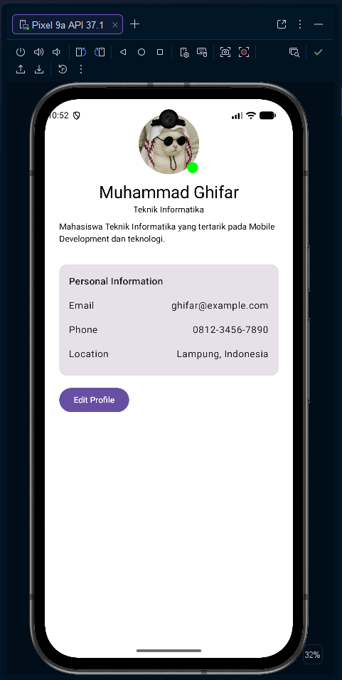
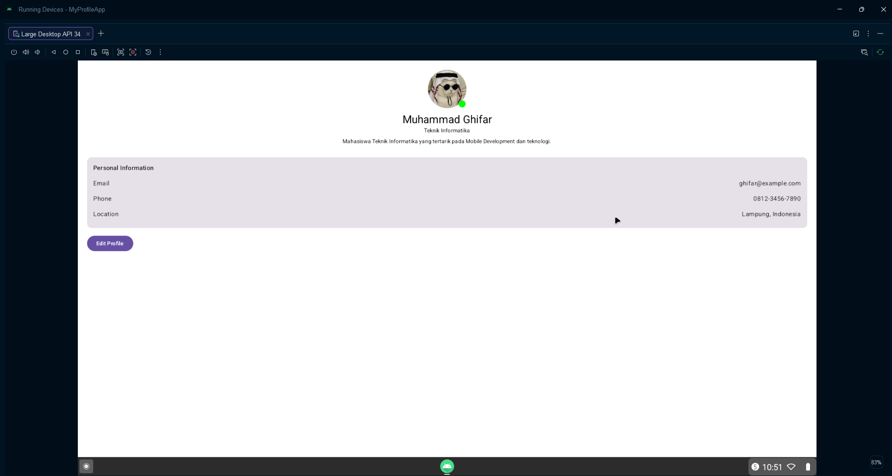

# My Profile App

Aplikasi profile sederhana menggunakan **Kotlin Multiplatform** dan **Compose Multiplatform** yang dapat dijalankan pada Android dan Desktop.

## 📱🖥️ Platform

* Android
* Desktop

## ✨ Fitur

* Menampilkan foto profil
* Menampilkan nama dan jurusan
* Menampilkan deskripsi singkat
* Menampilkan informasi personal
* Indikator status online
* Tombol **Edit Profile**
* Menampilkan pesan ketika tombol Edit Profile ditekan
* Tampilan yang dapat digunakan pada Android dan Desktop

## 🛠️ Teknologi

* Kotlin
* Kotlin Multiplatform
* Compose Multiplatform
* Material 3
* Gradle

## 📐 Layout

Aplikasi menggunakan layout vertikal yang sama pada Android maupun Desktop.

```text
Profile Header
      ↓
Personal Information
      ↓
Edit Profile
```

Pada Desktop, ukuran konten dibatasi agar tampilan tetap nyaman dan tidak terlalu melebar.

## 📸 Hasil Build

### Android



### Desktop



## 📂 Struktur Project

```text
myprofileapp/
├── composeApp/
│   └── src/
│       ├── commonMain/
│       ├── androidMain/
│       └── desktopMain/
│
├── screenshots/
│   ├── android.png
│   └── desktop.png
│
├── gradle/
├── build.gradle.kts
├── settings.gradle.kts
└── README.md
```

## ▶️ Menjalankan Project

### Android

Project dapat dijalankan menggunakan Android Studio melalui emulator atau perangkat Android.

### Desktop

Project dapat dijalankan menggunakan konfigurasi Desktop yang tersedia pada Android Studio.

## 👨‍💻 Author

**Muhammad Ghifar**

Teknik Informatika
